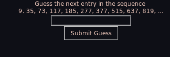

# The Integer Sequence Guessing Game
##### Given a sequence of integers, can you guess the next one? 

In this game, players declare a number of terms of a random sequence pulled from the [OEIS](https://oeis.org/) (Online Encyclopedia of Integer Sequences) to be shown. Then players must try to determine the next. If the player gives up, they'll be provided the OEIS ID of the sequence used so they can read all about what the numbers mean. 

### How to Play

Clone this repository and navigate to src/ and run `python main.py` to have a GUI pop-up to facilitate gameplay, via Tkinter. Here are some sample pictures of gameplay.

 

### Libraries Used
* Tkinter
* Requests
